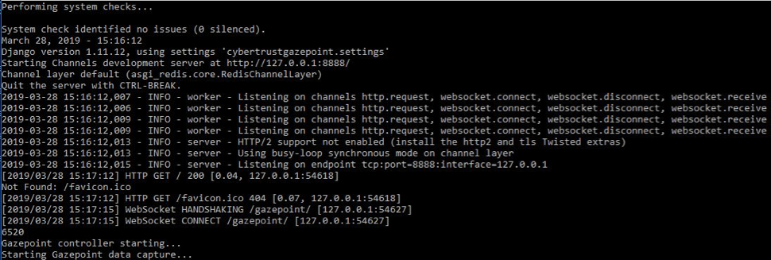
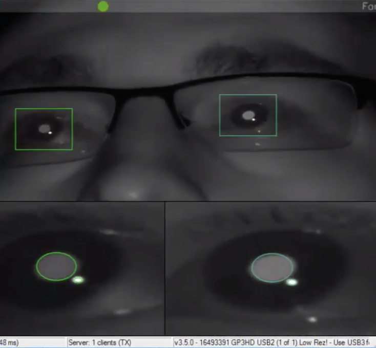
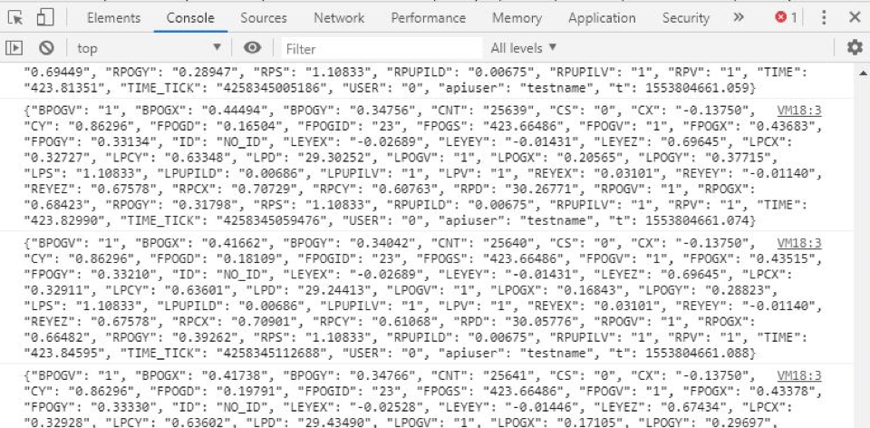
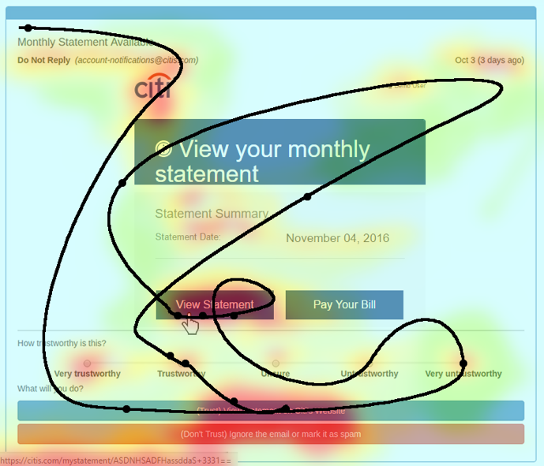

# Summary
Eye trackers enable a wide range of research and development activities in academia, medicine, and industry. Researchers and developers using eye trackers are able to collect rich user interaction data such as user fixation durations, points of gaze, and 3D models of user pupils that enable unique analysis and applications in areas such as user-interaction design, rehabilitative/restorative medicine, and marketing. Most eye trackers, including the two with the largest market share `Gazepoint GP3 HD`[@gazepoint] and the `Tobii Pro X3-120` [@tobii], ship with proprietary desktop software packages that collect, house, and analyze captured data. This closed source delivery model makes it difficult for researchers and developers to directly interact with raw eye tracker data, which prevents custom analysis and hinders application development and integration efforts. Further, most closed-source eye tracker analysis tools do not support streaming and real-time analysis applications.

While the Gazepoint GP3 HD[@gazepoint] is designed to work with Gazepoint’s proprietary analysis software, it also provides an underutilized alternative low-level XML-based API called OpenGaze for extracting data from the hardware. We have created a tool on top of OpenGaze called `Eyestream`. `Eyestream` is capable of serializing hardware-captured eye tracker data as JSON and streaming it in real-time, at frequencies up to 150hz, to desktop, web, or mobile applications. `Eyestream` is an open source package designed to operate as middleware between the Gazepoint GP3 and applications that consume eye tracker data for analysis or visualization purposes. It was implemented using Python 2.7, a web socket server framework called `Django Channels`[@channels], an in-memory database caching tool called `Redis`[@redis], and a modified version of `PyOpenGaze`[@opengaze]. `Eyestream` is containerized using `Docker` [@docker]. 

> Figure 1: System-level Architecture of Eyestream
 
# Eyestream and Its Uses
`Eyestream` provides a real-time streaming interface to other software applications that enable a wide-variety of applications. The streaming interface is built using websockets. Any application on any platform or written in any language can interact with `Eyestream` provided that it can establish a websocket. All major languages (C/C++/C#, Python, Java, JavaScript, Ruby, Go, etc) have direct or library support for websockets, making `Eyestream`'s approach widely open. Figures 2, 3, and 4 show the `Eyestream` platform from three perspectives: 2) The `Eyestream` server running in the command line, 3) Eyestream's invocation of the underlying Gazepoint eye monitoring software, and 4) a console, in Google Chrome Developer Tools, printing streaming eye data it is receiving from the server.

	

> Figure 2: Eyestream's websocket server running on console

> Figure 3: Gazepoint real-time eye monitor invoked by Eyestream

> Figure 4: Data streaming to a browser is printed in the console

One common use for real-time eyetracker data is the generation of real-time heatmaps showing the temporal progression of user eye movements. An example application using `Eyestream` to build real-time heatmaps is shown in Figure 5. This application, called `Cybertrust`, is a research and training platform that helps users identify phishing attempts. In this example, as the user’s gaze travels across the screen (depicted as the black line), the heatmap overlay gradually changes color to reflect the amount of time spent fixating on a particular area. Heatmap data is rendered using a D3 plot so that users and trainers can see what they are focusing on within phishing content. 

Other possible applications for `Eyestream` include medical tools for restorative eye or stroke care, examining areas of interest within a page for UI design or marketing, and as an interaction modality for video games or virtual reality systems.

> Figure 5: Heatmap of Eye Movements as viewed in a phishing training app
 
# On-going research projects using Eyestream
Eyestream is currently in use within the `Cybertrust` phishing research platform [1-3]. `Cybertrust` is a gamified experimentation platform used to identify factors related to phishing victimization. 

# License 
Eyestream is licensed under the GNU General Public License and can be found on the following GitHub repository: https://github.com/MLHale/eyestream.

# Acknowledgements

We acknowledge contributions by Gabi Wethor ([@gewethor](https://github.com/gewethor)) for her work in testing the Cybertrust platform.

# References
[1]	M. L. Hale, C. Walter, J. Lin, and R. F. Gamble, "A priori Prediction of Phishing Victimization Based on Structural Content Factors," International Journal of Services Computing, 2016.
[2]	M. L. Hale, R. Gamble, J. Hale, M. Haney, J. Lin, and C. Walter, "Measuring the Potential for Victimization in Malicious Content," in Web Services (ICWS), 2015 IEEE International Conference on, 2015, pp. 305-312: IEEE.
[3]	M. L. Hale, R. F. Gamble, and P. M. Gamble, "CyberPhishing: A Game-Based Platform for Phishing Awareness Testing," 48th Hawaii International Conference on System Sciences, 2015.
