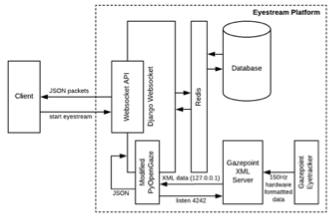
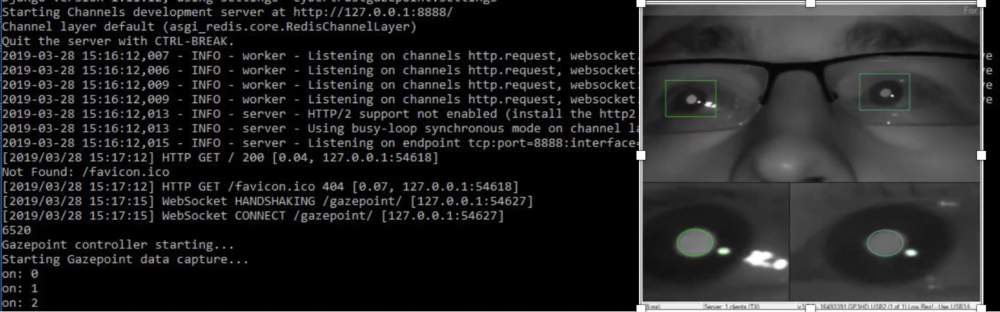

# Summary
Eye trackers enable a wide range of research and development activities in academia, medicine, and industry. Researchers and developers using eye trackers are able to collect rich user interaction data such as user fixation points, point of gaze, and 3D models of user pupils that enable unique analysis and applications in areas such as user-interaction design, rehabilitative/restorative medicine, and marketing. Many eye trackers currently on the market, such as the `Gazepoint GP3 HD`[@gazepoint] and the `Tobii Pro X3-120` [@tobii], ship with proprietary desktop software packages that collect, house, and analyze captured data. This closed source delivery model makes it difficult for researchers and developers to directly interact with raw eye tracker data, which prevents custom analysis and hinders application development and integration efforts. Further, most closed-source eye tracker analysis tools do not support streaming and real-time analysis applications.

While the Gazepoint GP3 HD[@gazepoint] is designed to work with Gazepoint’s proprietary analysis software, it also provides an alternative  low-level XML-based API called OpenGaze  for extracting data from the hardware. We have created a tool on top of OpenGaze called `Eyestream`. `Eyestream` is capable of serializing hardware-captured eye tracker data as JSON and streaming it in real-time, at frequencies up to 150hz, to desktop, web, or mobile applications. Eyestream is an open source package designed to operate as middleware between the Gazepoint GP3 and applications that consume eye tracker data for analysis or visualization purposes. It was implemented using Python 2.7, a web socket server framework called `Django Channels`[@channels], an in-memory database caching tool called `Redis`[@redis], and a modified version of `PyOpenGaze`[@opengaze]. Eyestream is containerized using `Docker` [@docker]. 

> Figure 1: System-level Architecture of Eyestream
 
# Eyestream and Its Uses
Eyestream supports web socket openings from JavaScript allowing for an established connection between the client and the server. Figure 2 provides a screenshot of the successful websocket connection after launching Eyestream in the command line. Once the connection has been made between the modified version of PyOpenGaze and the Gazepoint XML server, eye tracker events travel through the established connection. Our modifications to PyOpenGaze include the transformation of the captured Gazepoint eye tracker events from XML format to JSON. These transformed eye tracker events are presented on the clientside at a frequency of up to 150hz. Figure 3 provides a screenshot of the flow of JSON packets to the client in the Google Chrome Developer Tools console. 
	

Figure 2: Eyestream Running in Command Line
 

Figure 3: Chrome Developer Tools Console
 
 

The use of Eyestream allows the real-time generation of heatmaps of the temporal progression of user eye movements (as shown in Figure 4). As the user’s gaze travels across the screen (depicted as the black line), the heatmap overlay gradually changes color depending on the amount of time spent fixating on a particular area. Unviewed areas are rendered as blue and viewed areas are rendered as a gradient from green to red, depending on the time spent fixating on the particular point on the screen. 
Figure 4: Heatmap of Eye Movements
 
On-going research projects using Eyestream
Eyestream is currently being implemented in the Cybertrust phishing research platform [1-3]. Cybertrust is a gamified experimentation platform used to identify factors related to phishing victimization. Eyestream is licensed under the GNU General Public License and can be found on the following GitHub repository: https://github.com/MLHale/eyestream.

# References

[1]	M. L. Hale, C. Walter, J. Lin, and R. F. Gamble, "Apriori Prediction of Phishing Victimization Based on Structural Content Factors," International Journal of Services Computing, 2016.
[2]	M. L. Hale, R. Gamble, J. Hale, M. Haney, J. Lin, and C. Walter, "Measuring the Potential for Victimization in Malicious Content," in Web Services (ICWS), 2015 IEEE International Conference on, 2015, pp. 305-312: IEEE.
[3]	M. L. Hale, R. F. Gamble, and P. M. Gamble, "CyberPhishing: A Game-Based Platform for Phising Awareness Testing," 48th Hawaii International Conference on System Sciences, 2015.

The forces on stars, galaxies, and dark matter under external gravitational
fields lead to the dynamical evolution of structures in the universe. The orbits
of these bodies are therefore key to understanding the formation, history, and
future state of galaxies. The field of "galactic dynamics," which aims to model
the gravitating components of galaxies to study their structure and evolution,
is now well-established, commonly taught, and frequently used in astronomy.
Aside from toy problems and demonstrations, the majority of problems require
efficient numerical tools, many of which require the same base code (e.g., for
performing numerical orbit integration).

``Gala`` is an Astropy-affiliated Python package for galactic dynamics. Python
enables wrapping low-level languages (e.g., C) for speed without losing
flexibility or ease-of-use in the user-interface. The API for ``Gala`` was
designed to provide a class-based and user-friendly interface to fast (C or
Cython-optimized) implementations of common operations such as gravitational
potential and force evaluation, orbit integration, dynamical transformations,
and chaos indicators for nonlinear dynamics. ``Gala`` also relies heavily on and
interfaces well with the implementations of physical units and astronomical
coordinate systems in the ``Astropy`` package [@astropy] (``astropy.units`` and
``astropy.coordinates``).

``Gala`` was designed to be used by both astronomical researchers and by
students in courses on gravitational dynamics or astronomy. It has already been
used in a number of scientific publications [@Pearson:2017] and has also been
used in graduate courses on Galactic dynamics to, e.g., provide interactive
visualizations of textbook material [@Binney:2008]. The combination of speed,
design, and support for Astropy functionality in ``Gala`` will enable exciting
scientific explorations of forthcoming data releases from the *Gaia* mission
[@gaia] by students and experts alike.

# Mathematics

Single dollars ($) are required for inline mathematics e.g. $f(x) = e^{\pi/x}$

Double dollars make self-standing equations:

$$\Theta(x) = \left\{\begin{array}{l}
0\textrm{ if } x < 0\cr
1\textrm{ else}
\end{array}\right.$$

# Acknowledgements

We acknowledge contributions from Brigitta Sipocz, Syrtis Major, and Semyeong
Oh, and support from Kathryn Johnston during the genesis of this project.

# References
